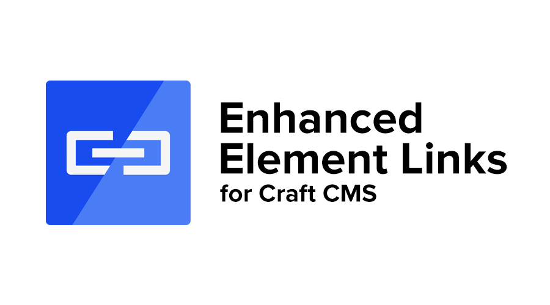
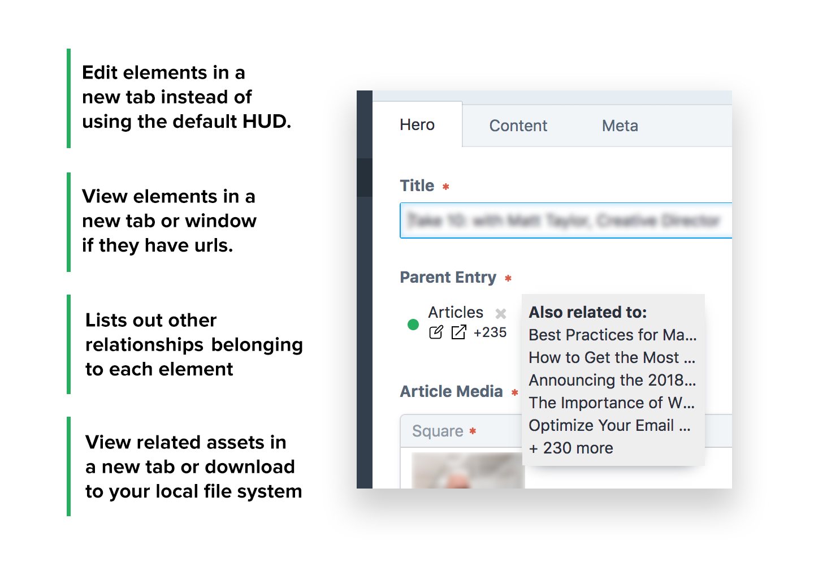

# Enhanced Element Links

A simple plugin to provide an easier way to edit, view, download and more to element fields (entries, categories, assets).

## Requirements

This plugin requires Craft CMS 3.0.0-beta.23 or later.

## Installation

To install the plugin, follow these instructions.

1. Open your terminal and go to your Craft project:

        cd /path/to/project

2. Then tell Composer to load the plugin:

        composer require fvaldes33/enhanced-element-links

3. In the Control Panel, go to Settings → Plugins and click the “Install” button for Element Links.

## Element Links Overview

The HUD is a nice feature but at times, we need the full screen. This plugin will add cp links to all entries and categories. Download links for asset elements and it will also provide front end facing links if urls are enabled for the element in question. In addition, it will also show you where else these related elements are being used.

## Element Links Roadmap

* Release
* Adding in HUD support

Brought to you by [Franco Valdes](https://github.com/fvaldes33)
